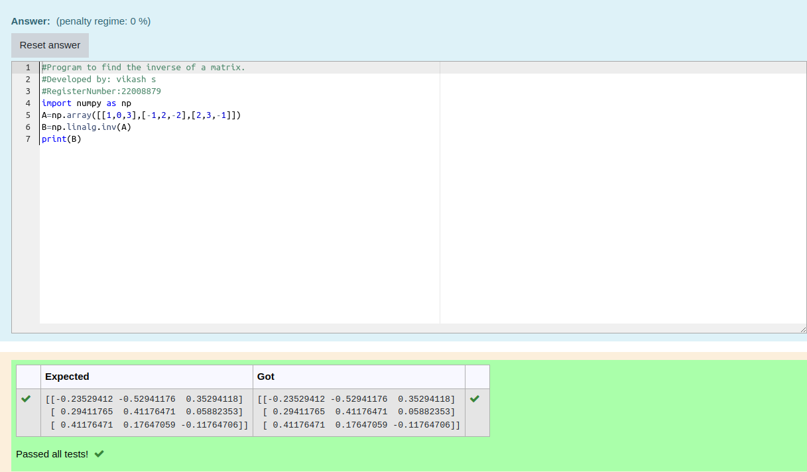

# INVERSE-OF-A-MATRIX
## Aim:
To write a python program to find the inverse of a matrix
## Equipment’s required:
1. 	Hardware – PCs
2. 	Anaconda – Python 3.7 Installation / Moodle-Code Runner
## Algorithm:
### Step 1 : 
Import the numpy module to use the built-in functions for calculation

### Step 2: 
Prepare the lists from each linear equations and assign in np.array()

### Step 3: 
Using the np.linalg.solve(), we can find the solutions.

### Step 4: 
End the program
## Program:
```python
#Program to find the inverse of a matrix.
#Developed by: vikash s
#RegisterNumber:22008879
import numpy as np 
A=np.array([[1,0,3],[-1,2,-2],[2,3,-1]])
B=np.linalg.inv(A)
print(B)
```
## Output:



## Result:
Thus the inverse of given matrix is successfully solved using python program

